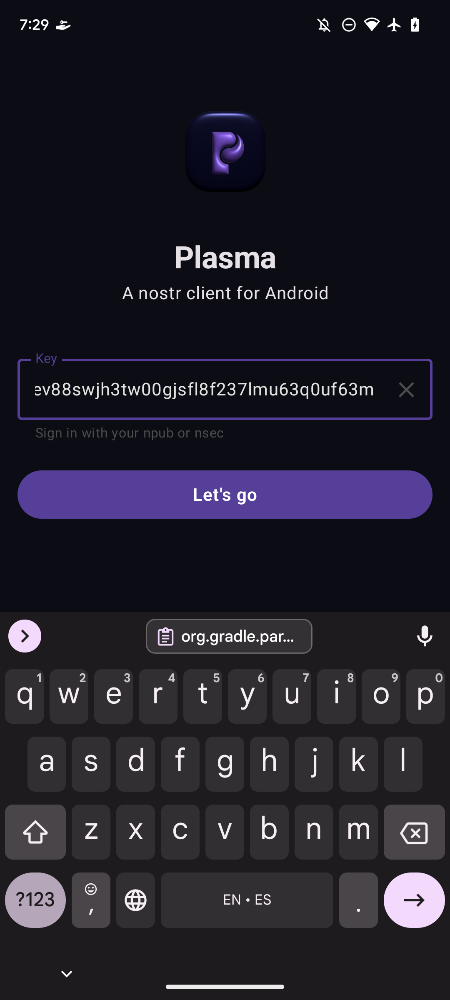
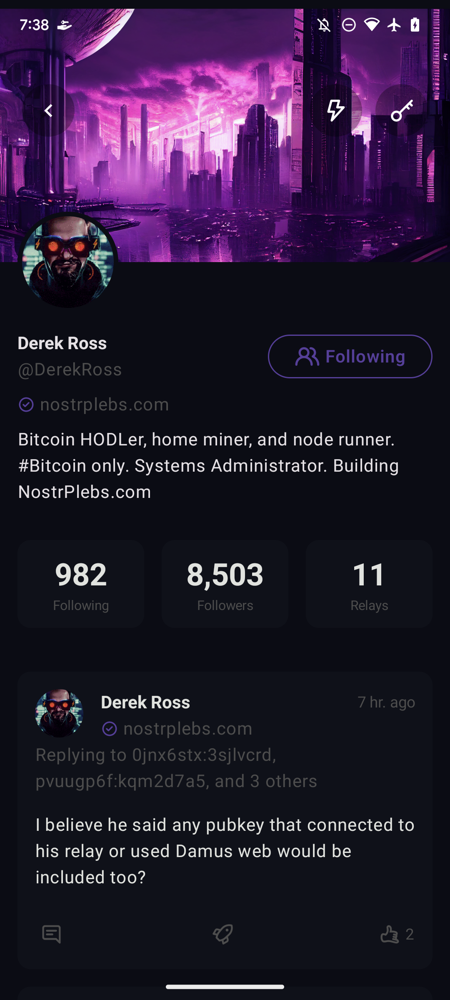
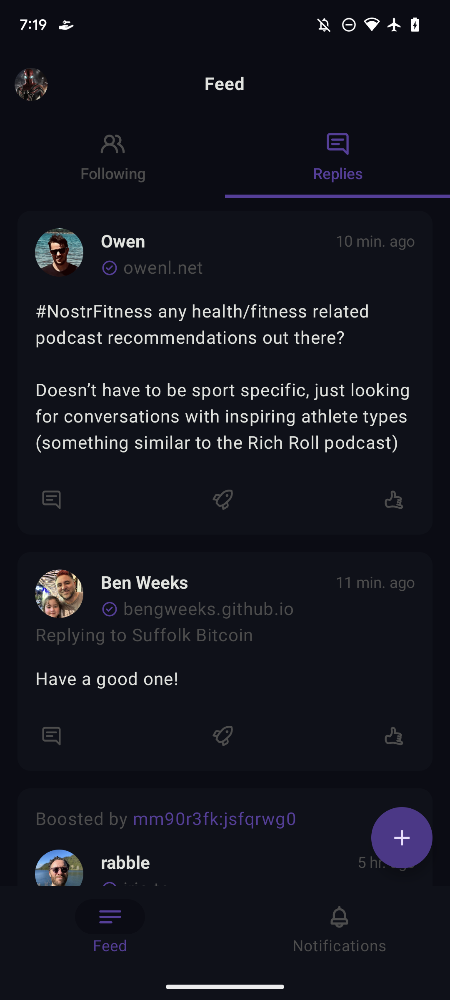
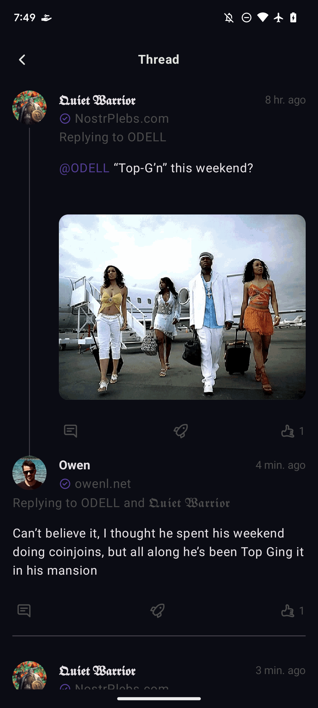
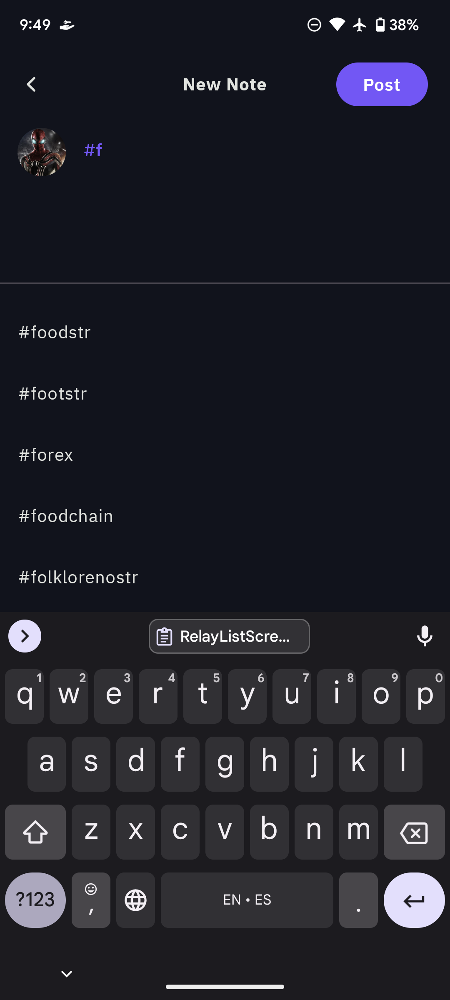
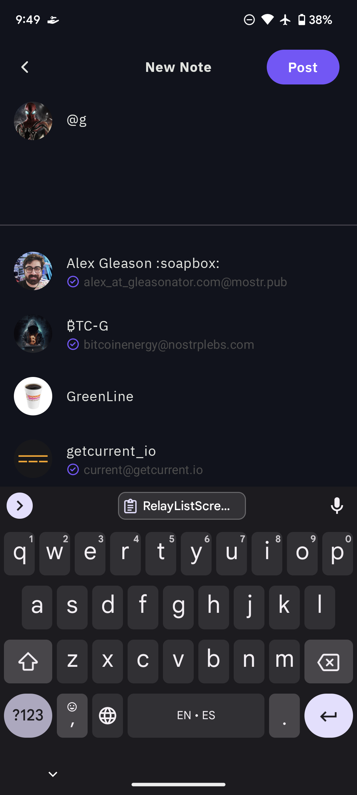
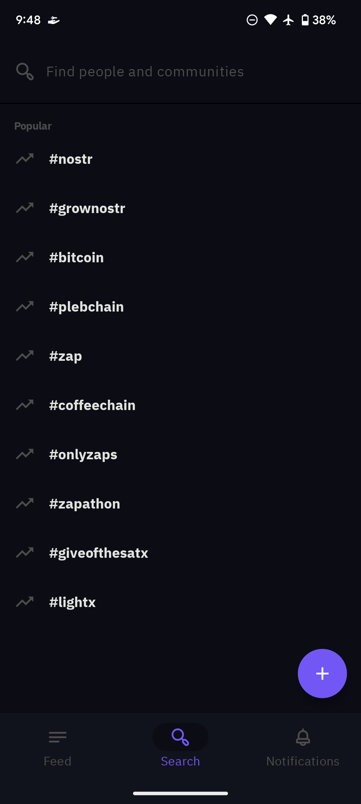
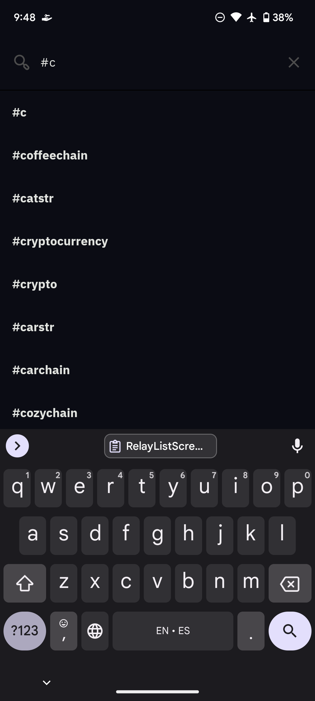

# plasma

An offline-first social media app for Android, built on
the [nostr](https://github.com/nostr-protocol/nostr) protocol.

## NIPS Implemented

- [✅] [NIP-01: Basic protocol flow description](https://github.com/nostr-protocol/nips/blob/master/01.md) 
- [✅] [NIP-02: Contact List and Petnames](https://github.com/nostr-protocol/nips/blob/master/02.md) 
- [ ] [NIP-04: Encrypted Direct Message](https://github.com/nostr-protocol/nips/blob/master/04.md) 
- [✅] [NIP-05: Mapping Nostr keys to DNS-based internet identifiers](https://github.com/nostr-protocol/nips/blob/master/05.md) 
- [✅] [NIP-08: Handling Mentions](https://github.com/nostr-protocol/nips/blob/master/08.md) 
- [ ] [NIP-09: Event Deletion](https://github.com/nostr-protocol/nips/blob/master/09.md) 
- [ ] [NIP-10: Conventions for clients' use of `e` and `p` tags in text events](https://github.com/nostr-protocol/nips/blob/master/10.md) 
- [ ] [NIP-11: Relay Information Document](https://github.com/nostr-protocol/nips/blob/master/11.md) 
- [🚧] [NIP-18: Reposts](https://github.com/nostr-protocol/nips/blob/master/18.md) 
- [ ] [NIP-19: bech32-encoded entities](https://github.com/nostr-protocol/nips/blob/master/19.md) 
- [ ] [NIP-21: `nostr:` URL scheme](https://github.com/nostr-protocol/nips/blob/master/21.md) 
- [ ] [NIP-23: Long-form Content](https://github.com/nostr-protocol/nips/blob/master/23.md) 
- [✅] [NIP-25: Reactions](https://github.com/nostr-protocol/nips/blob/master/25.md) 
- [] [NIP-27: Text Note References](https://github.com/nostr-protocol/nips/blob/master/27.md) 
- [] [NIP-47: Nostr Wallet Connect](https://github.com/nostr-protocol/nips/blob/master/47.md) 
- [ ] [NIP-50: Search](https://github.com/nostr-protocol/nips/blob/master/50.md) 
- [ ] [NIP-56: Reporting](https://github.com/nostr-protocol/nips/blob/master/56.md) 
- [🚧] [NIP-57: Lightning Zaps](https://github.com/nostr-protocol/nips/blob/master/57.md) 
- [ ] [NIP-65: Relay List Metadata](https://github.com/nostr-protocol/nips/blob/master/65.md) 
- [ ] [NIP-78: Arbitrary custom app data](https://github.com/nostr-protocol/nips/blob/master/78.md) 
